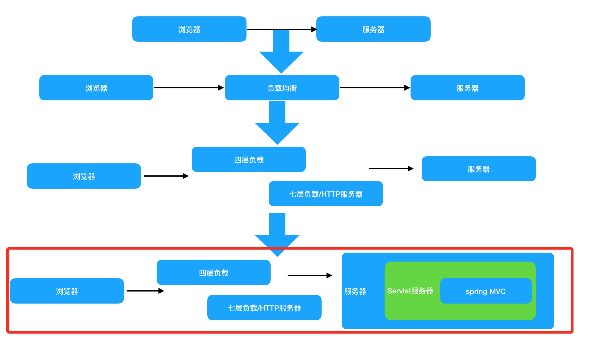

--
description: 后端（JAVA）开发的点滴记录与经验分享
---

# 性能优化篇

## “性能优化”的认识

以开发的视角来看：  
**性能**的直观理解其实就是计算机去执行一个任务，从发起到完成的耗时情况的表现。  
**性能优化**的话，其实无非就是提高应用性能、降低资源消耗、解决吞吐瓶颈、提升用户体验等。  
我们以分布式部署的java应用来看，其实我们按照上面的性能定义，其实我们的任务大致包含以下步骤：

